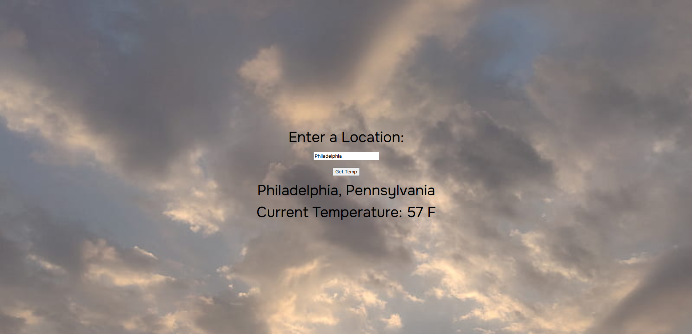

# Simple to Do List Site

Link to project: (https://localweathergetter.netlify.app/)

## How It's Made:
Tech used: HTML, CSS, JS

A basic application that allows users to type in a city. Upon submitting, a fetch request is made to (https://www.weatherapi.com/), which returns the current temperature in that location.

## Optimizations

The fetch request has been optimized to allow users to type in a state to get the location, or get a more specific temperature by typing both city and state - whichever they prefer.

